# Trabajo Práctico 1 - Taller de Programación - Contador de Palabras

Alumno: Robinson Fang

Padrón: 97009

Repositorio: https://github.com/fangrobinson/taller-de-programacion-1-veiga-contador-de-palabras

## Entorno de trabajo

### Valgrind

Valgrind es una herramienta de análisis que facilita la depuración de un programa. Permite encontrar memoria que se reservó y luego de ser utilizada no es liberada, lecturas/escrituras en memoria liberada o fuera de los límites reservados.

Entre sus opciones más comunes se encuentran:

- **quiet**
	> muestra únicamente mensajes de errores
	
- **verbose**
	> muestra información adicional
	
- **leak-check**=full/yes/no
	> habilita/deshabilita la funcionalidad de detección de fugas de memoria
	
- **show-reachable**=yes/no
	> habilita/deshabilita la detección de memoria de la que no se conservan referencias


### sizeof()

sizeof() devuelve el tamaño en bytes que ocupa en memoria un tipo de datos o estructura.

El sizeof(char) es siempre 1 byte independientemente de la arquitectura del computador utilizado. Pero para el tipo de dato entero, el tamaño que ocupa en memoria puede variar según la arquitectura o el computador. Para una arquitectura de 32 o 64 bits, por ejemplo, el tamaño de un entero es de 4 bytes.

**En una maquina de 64 bits, el tamaño del entero PUEDE o NO ser de 4 bytes, depende del compilador.**

No necesariamente el sizeof() de una struct de C es igual a la suma del sizeof() de cada uno sus elementos. Esto se debe a que por una cuestión de performance a la hora de acceder a memoria, los datos se alinean de forma tal que el acceso a memoria sea de a bloques múltiplos de 4 bytes. Es por esto que si se tiene la siguiente estructura:
```
struct char_and_int {
	char a;
	int i;
};
```
Aunque el tipo de dato char ocupe un byte, se utilizará un bloque de 4 para almacenarlo. El tamaño de la struct es de 8 bytes.

### STDIN, STDOUT y STDERR

- STDIN (entrada estándar) son los datos que recibe para su ejecución.
- STDOUT (salida estándar) son los datos que devuelve un programa luego de su ejecución.
- STDERR (error estándar) es la devolución de los errores presentados durante la ejecución de un programa. Es un canal distinto de la salida estándar, lo que permite distinguir el manejo de la obtención de uno u otro. 

Con el comando '>' se puede redirigir el output de un proceso hacia un archivo o dispositivo. Usualmente la salida de un programa se muestra por pantalla en la terminal, pero con el uso de la redirección de output se puede volcar la salida a un archivo o agregarla a la información preexistente con '>>'.
De forma análoga el operador < permite alimentar la entrada de un proceso.

Se puede alimentar la entrada de un proceso con la salida secuencialmente y de forma unidireccional utilizando '|' con la siguiente sintaxis:
```
proceso1 | proceso2 | proceso3
```

## Paso 0:

Se realizó un programa simple que imprime por pantalla el mensaje “Hola Mundo”.

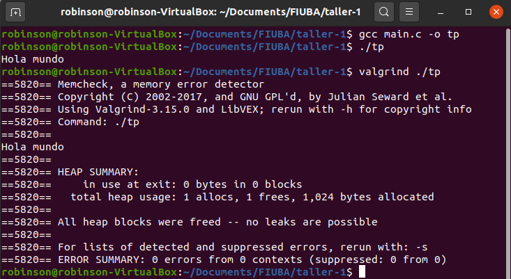

## Paso 1: SERCOM - Errores de generación y normas de programación

### Errores de estilo

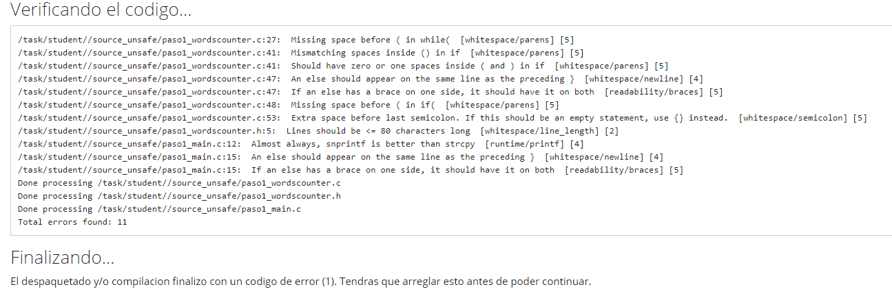

####  paso1_wordscounter.c

> - línea 27: no se respeta el espacio previo a la cláusula while.
> - línea 41: espacios extras dentro de los paréntesis de la cláusula if.
> - línea 47: la cláusula else debe estar pegada a la llave de cierre '}' de la línea anterior.
> - línea 48: no se respeta el espacio previo a la cláusula if.
> - línea 53: el espacio previo al ';' es innecesario.

####  paso1_wordscounter.h

> - línea 5: se excede el largo máximo para una línea (80 caracteres).

####  paso1_main.c

> - línea 12: se prefiere el uso de snprintf a strcpy.
> - línea 15: la cláusula else debe estar pegada a la llave de cierre '}' de la línea anterior.

### Errores de compilación/linkedición

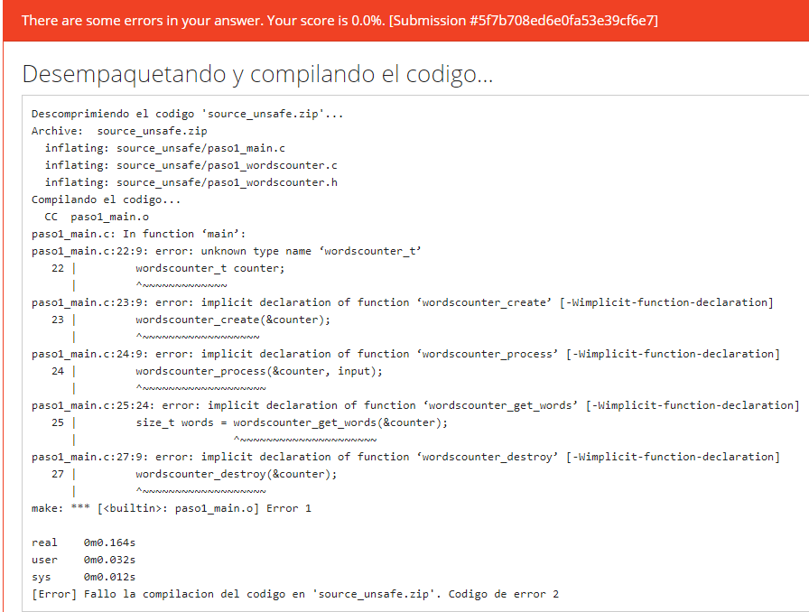

####  paso1_main.c

> - paso1_main.c:22:9: error: unknown type name ‘wordscounter_t’
> - paso1_main.c:23:9: error: implicit declaration of function ‘wordscounter_create’ 
> - paso1_main.c:24:9: error: implicit declaration of function ‘wordscounter_process’ 
> - paso1_main.c:25:24: error: implicit declaration of function ‘wordscounter_get_words’
> - paso1_main.c:27:9: error: implicit declaration of function ‘wordscounter_destroy’

El archivo paso1_main.c está haciendo referencias a estructuras y funciones de módulos no importados. Esto produce errores de compilación por lo que no se genera código objeto.

El sistema no reportó warnings porque está utilizando el flag *Werror* que transforma warnings en errores. 

## Paso 2: SERCOM - Errores de generación 2

#### Cambios respecto a la versión anterior: 

Se realizaron las correcciones de estilo necesarias para respetar la normativa de codificación CPPLINT, como así también se realizó el siguiente cambio en el main.c:
```
<         strcpy(filepath, argv[1]);
>         memcpy(filepath, argv[1], strlen(argv[1]) + 1);
```
La funcionalidad entre ambas operaciones es distinta: strcpy se detiene frente a un byte nulo ('\0'), mientras que memcpy requiere como parámetro el largo. 

### Errores encontrados


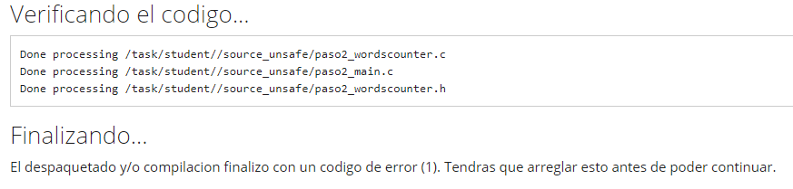

No se encontraron errores de estilo.

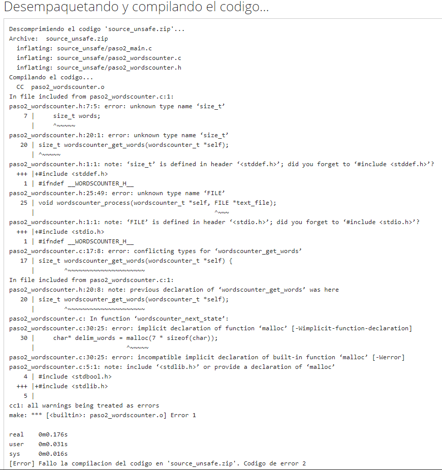

> - paso2_wordscounter.h:7:5: error: unknown type name ‘size_t’
> - paso2_wordscounter.h:20:1: error: unknown type name ‘size_t’
> - paso2_wordscounter.h:25:49: error: unknown type name ‘FILE’
> - paso2_wordscounter.c:17:8: error: conflicting types for ‘wordscounter_get_words’
> - paso2_wordscounter.c:30:25: error: implicit declaration of function ‘malloc’
> - paso2_wordscounter.c:30:25: error: incompatible implicit declaration of built-in function ‘malloc’ 

Se utiliza el tipo de datos 'size_t' definido en el módulo stddef.h (que puede importarse directamente con stdlib.h) sin incluirlo.  Lo mismo ocurre con el tipo 'FILE' y stdio.h. Por su parte, malloc requiere la inclusión de stdlib.h.

Todos los errores son de compilación.

## Paso 3: SERCOM - Errores de generación 3

#### Cambios respecto a la versión anterior: 

Se incluyeron los módulos utilizados.

### Errores encontrados

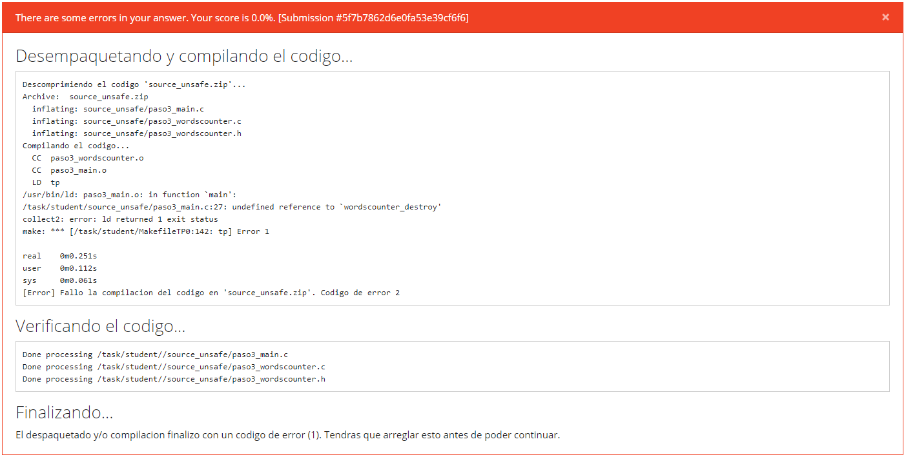

Aunque esta vez se pudieron generar los códigos objeto de los procesos, hubo una falla en el momento de link, ya que aunque el archivo main.c tiene una referencia a 'wordscounter_destroy', esta no fue implementada. Cuando se compilan los archivos por separado esto puede no representar un error si es definida luego, cosa que no ocurre en este caso.

## Paso 4: SERCOM - Memory Leaks y Buffer Overflows

#### Cambios respecto a la versión anterior: 

Se implementó una función 'wordscounter_destroy' rudimentaria que no hace nada. 

### Errores encontrados

#### Caso TDA

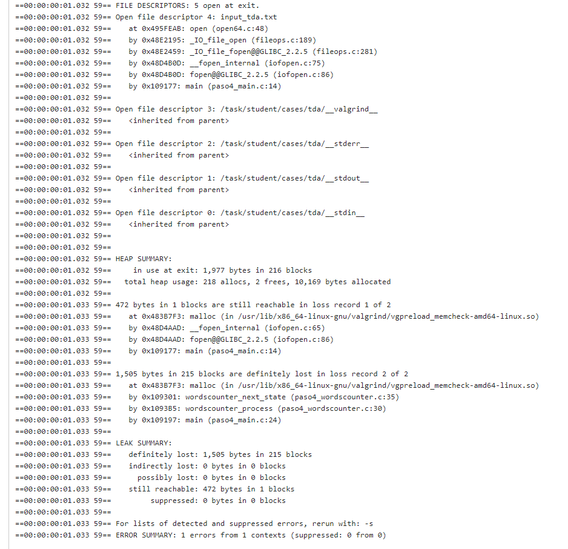

Para las pruebas 'tda':
> - 472 bytes in 1 blocks are still reachable in loss record 1 of 2
> - 1,505 bytes in 215 blocks are definitely lost in loss record 2 of 2

472 bytes no fueron liberados al finalizar la ejecución del programa y aún se conservan referencias a estos. 
1505 bytes se perdieron ya que al finalizar el programa no fueron liberados y no se conservan referencias a estos, por lo que no podrían liberarse.
**Estaría bueno aclarar por qué se deben estos leaks (files no cerrados, mallocs no liberados)**

#### Caso Long Filename

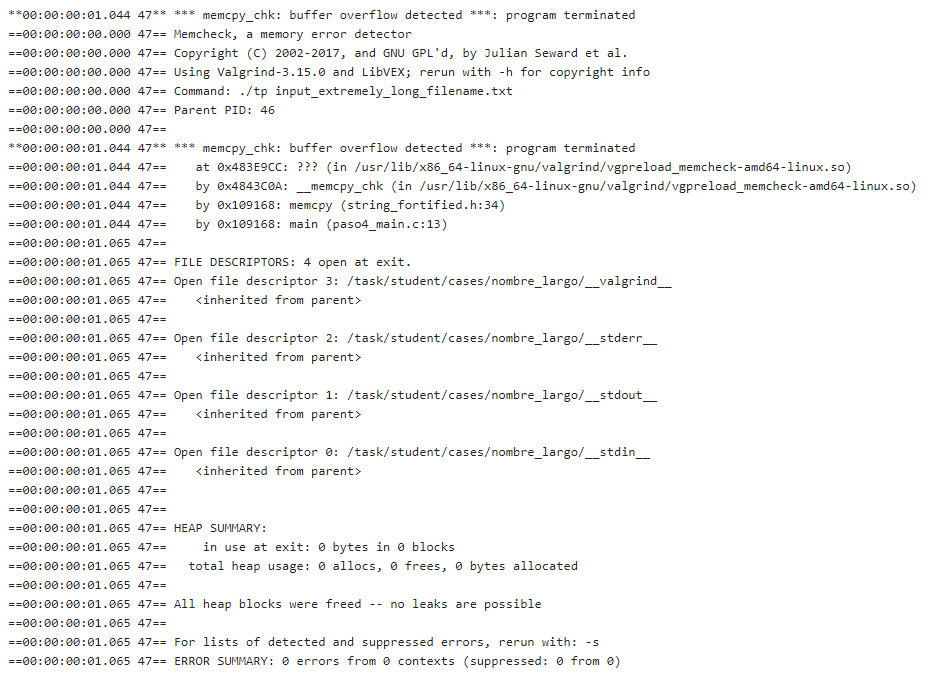

Para las pruebas 'long_filename' 	el programa cortó su ejecución ya que se encontró con un buffer overflow. Usando str**n**cpy se evitaría el problema de buffer overflow, pero de igual manera la ejecución del programa habría encontrado un error al no hallar el archivo. 
**strncpy no necesariamente hubiera solucionado el problema, qué le pasarías como el parámetro length a strncpy?
dependiendo de la respuesta el problema persiste o no.**

Un segmentation fault ocurre cuando se intenta acceder a un bloque de memoria para el cual no se tiene permiso.
Buffer overflow es la escritura **(o lectura)** de datos en bloques de memoria adyacentes al destino original debido a una falta de chequeo de los límites correctos. 

## Paso 5: SERCOM - Código de retorno y salida estándar

#### Cambios respecto a la versión anterior: 

El filepath del archivo a utilizar se recibe por línea de comando al llamarse el programa, pero no se copia a en una cadena de 30 caracteres, lo que permite evitar el overflow que se estaba generando antes.
El array de caracteres delim_words ahora se define como una cadena (respetando el '\0') y no byte a byte.

### Errores encontrados

#### Caso  Invalid File

Para el caso de archivo inválido se retorna -1 asociado al código de ERROR que devuelve el programa y este se lee como entero sin signo 255 de acuerdo a lo esperado por el retorno de un programa main. 

#### Caso  Single Word

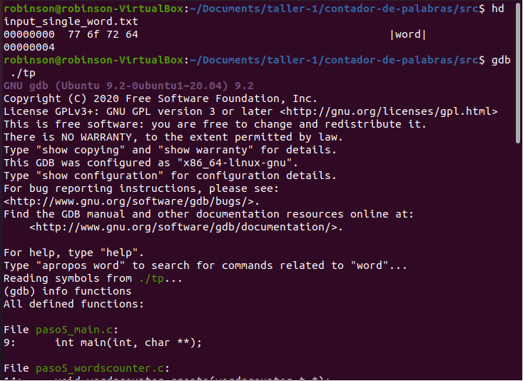

El último caracter del archivo input_single_word.txt, '64' en hex, es la letra 'd'. 
El error se debe al manejo de estados que suman uno a la cantidad de palabras.  Ya que al encontrarse el fin del archivo se debe sumar uno si anteriormente se encontraba procesando una palabra. 


### Debugging

Se realizó depuración con gdb verificando la salida de los siguientes comandos:

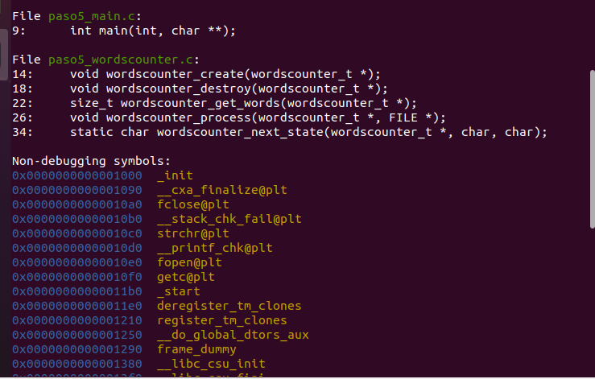
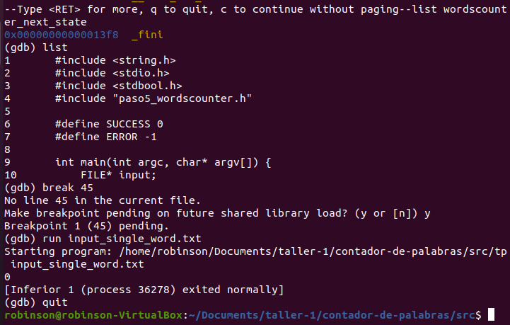

- info functions 
	> Detalla funciones y símbolos del programa
- list wordscounter_next_state 
	> Muestra por pantalla las líneas de código asociadas a la función pedida indicando número de línea.

- list 
	> imprime más líneas

- break 45 
	> inserta un breakpoint para examinar el estado de ejecución de un programa en la línea 45.

- run input_single_word.txt
	> ejecuta el programa con 'input_single_word.txt' como argumento.

En este caso luego de procesar la letra d, termina de procesar el archivo y devuelve 0, ya que no se sumó 1 asociado a la palabra 'word'. El programa nunca se detiene en el breakpoint porque el pasa de la letra d con estado IN WORD a fin del archivo, por lo que no pasaría nunca por la condiciones que llevan al breakpoint generado en la línea 45.

## Paso 6: SERCOM - Entrega exitosa

#### Cambios respecto a la versión anterior: 

DELIM_WORDS es ahora una constante del módulo en lugar de una variable de solo lectura que se define al llamarse la función. 

Se corrigió el manejo de estados que no permitía contabilizar palabras al final del archivo de texto a utilizar. 

Por último se corrigió el valor de retorno para una ejecución errónea de -1 a 1.


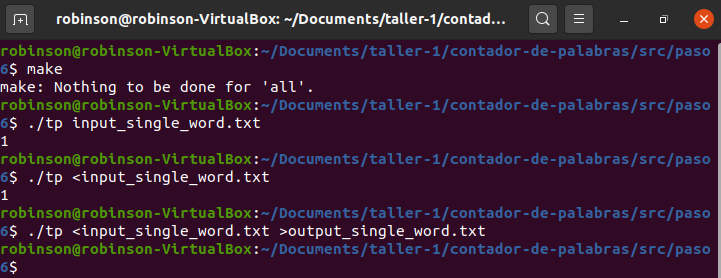